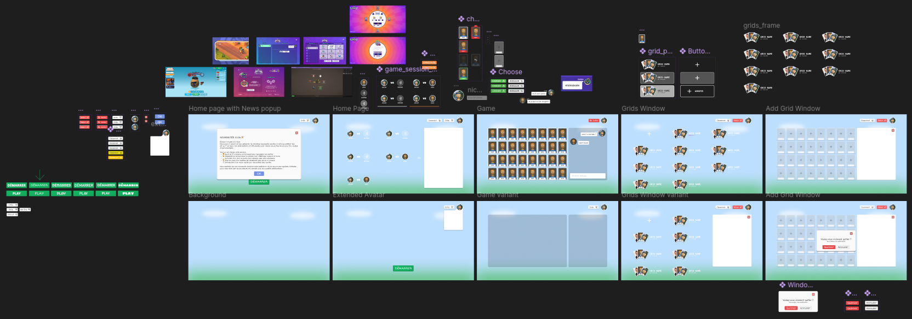
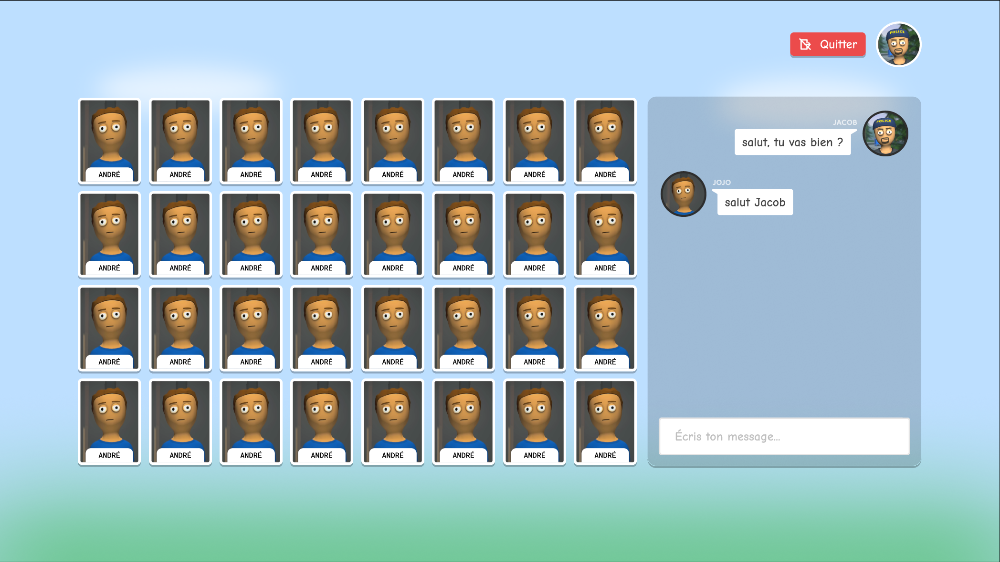
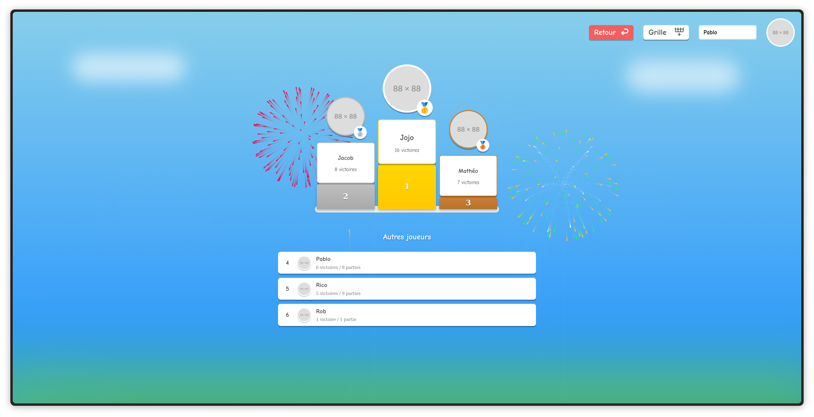
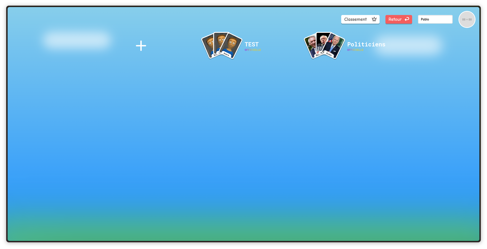
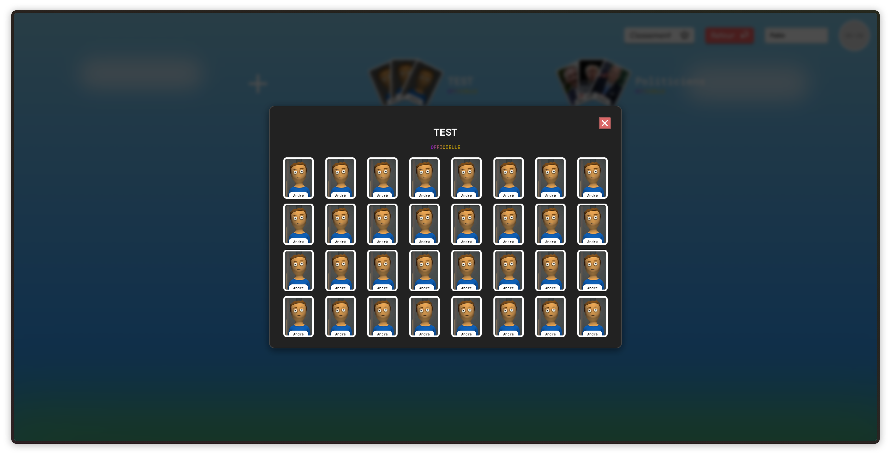
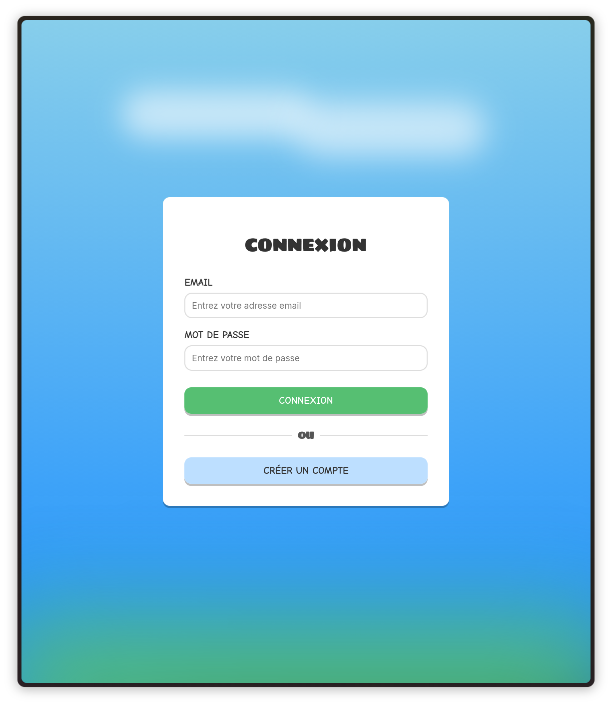
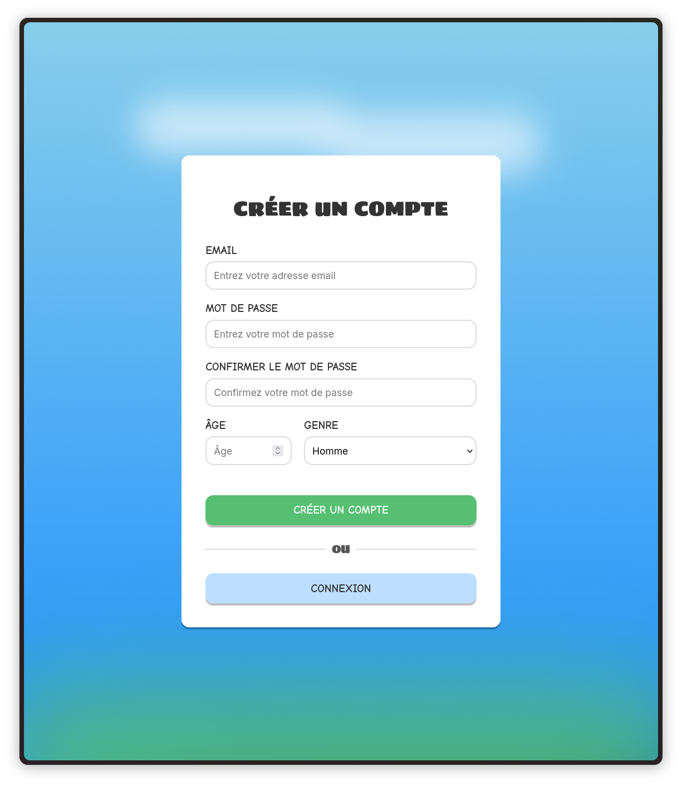

# Rapport de Projet : Jeu "Qui est-ce ?" en Ligne

## Introduction

Ce document présente le développement de l'application "Kies" qui vise à reproduire le jeu de société "Qui est-ce ?" en ligne. Il couvre normalement l'ensemble des fonctionnalités implémentées, les technologies utilisées et pourquoi, ainsi que les mesures prises pour garantir la qualité et la maintenabilité du code.
La plupart des features ont pu être implémentées, mais certaines restent manquantes. Une liste des fonctionnalités est présente plus loin dans le rapport.

## Démo

## Architecture Générale

L'application a été conçue suivant une architecture client-serveur découplée :

*   **Backend** : Développé en Java avec le framework Spring Boot, il gère toute la logique métier, l'accès aux données, l'authentification des utilisateurs, et la communication en temps réel via WebSockets.
*   **Frontend** : Développé avec Svelte et SvelteKit, il offre une interface utilisateur réactive et moderne pour interagir avec le jeu. La communication avec le backend se fait via des appels API REST et des WebSockets.
*   **Base de données** : Une base de données relationnelle PostgreSQL est utilisée. La persistance des données est gérée par Spring Data JPA.
*   **Conteneurisation** : L'ensemble de l'application (backend, frontend, base de données, et même pgAdmin) est conteneurisé à l'aide de Docker et orchestré avec Docker Compose, ce qui permettait de ne pas avoir de soucis lorsque l'on développait sur nos machines différentes et même lors du déploiement sur mon VPS.

## Technologies Utilisées
### Backend

Le backend a été développé en **Java** (version 17) et s'appuie principalement sur le framework **[`Spring Boot`](backend/pom.xml:8)** (version 3.4.4).

**Pourquoi Spring Boot ?**
Le choix de Spring Boot, plutôt que des serveurs d'applications Java EE traditionnels tels que GlassFish ou Tomcat, a été motivé par plusieurs avantages. Spring Boot accélère le développement et simplifie la configuration grâce à ses plugins/addons (Spring Boot DevTools, etc...), ce qui réduit la quantité de code boilerplate et de config initiales. Cela permet de se concentrer davantage sur la logique métier. De plus, Spring Boot intègre un serveur web embarqué (Tomcat par défaut), permettant à l'application d'être exécutée comme un simple fichier JAR (facile à intégrer dans notre conteneur). La gestion des dépendances est également facilitée par les "starters" de Spring Boot, qui regroupent des dépendances communes et assurent leur compatibilité. Enfin, Spring Boot bénéficie d'un vaste écosystème (Spring Data, Spring Security, etc.) et d'énormément de ressources et tutos sur leur site (ressources nous ayant bien aidé en fin de rapport).

Les modules Spring Boot spécifiques utilisés incluent [`Spring Web`](backend/pom.xml:35) pour la création des API REST, [`Spring WebSocket`](backend/pom.xml:40) pour la communication bidirectionnelle en temps réel (pour le chat essentiellement), [`Spring Data JPA`](backend/pom.xml:58) pour l'interaction avec la base de données PostgreSQL (les interfaces `JpaRepository` comme [`AccountDAO.java`](backend/src/main/java/dev/triomph/kies/DAO/AccountDAO.java:1) servant de couche d'accès aux données), et [`Spring Security`](backend/pom.xml:68) pour la gestion de l'authentification et la sécurisation des API.

L'authentification est gérée par des JSON Web Tokens (JWT) via la librairie [`jjwt`](backend/pom.xml:73), sécurisant les échanges client-serveur. La base de données choisie est [`PostgreSQL`](backend/pom.xml:51). La sérialisation et désérialisation JSON sont assurées par [`Jackson`](backend/pom.xml:62), avec des modules pour Hibernate ([`jackson-datatype-hibernate5-jakarta`](backend/pom.xml:63)) et Java Time API ([`jackson-datatype-jsr310`](backend/pom.xml:91)). L'outil de build utilisé est Maven.

### Frontend

Le frontend a été développé avec le framework JavaScript **[`Svelte`](frontend/package.json:30)** (en v5) et son meta-framework **[`SvelteKit`](frontend/package.json:21)**. Premier framework que l'on a utilisé, il est réputé comme l'un des meilleurs frameworks même si il est moins utilisé que React ou d'autres. (Quelques caractéristiques du framework : léger, rendu côté serveur (SSR) pour le SEO, simplicité du code, reactivité intégrée, etc...)
Les `<script>` sont écrits en TypeScript pour avoir une application plus robuste et maintenable. 

La communication WebSocket avec le backend Spring est établie grâce à **[`SockJS-client`](frontend/package.json:38)** et **[`@stomp/stompjs`](frontend/package.json:37)**. Pour une gestion d'état centralisée et réactive, les **stores Svelte** ([`writable`](frontend/src/lib/services/authService.ts:3), [`readable`](frontend/src/lib/services/gameService.ts:1)) ont été utilisé, gérant par exemple les informations du joueur et l'état de la partie. L'outil de build et de développement **[`Vite`](frontend/package.json:34)** a été utilisé pour sa rapidité et son "hot-reload". La qualité du code a été maintenue grâce à **[`ESLint`](frontend/package.json:24)** pour l'analyse statique et **[`Prettier`](frontend/package.json:28)** pour le formatage auto de certaines parties du code.

### Outils et Environnement

La conteneurisation de l'application est assurée par **[`Docker`](frontend/Dockerfile:1)**, pour créer des images du backend et du frontend, et **[`Docker Compose`](compose.yaml:1)**, pour orchestrer l'application multi-conteneurs. On a pull 2 images, une pour la base de données (PostgreSQL) et une pour pgAdmin (l'outil qui permet de gérer la base de données via une interface graphique). Les images du backend et du frontend sont construites à partir de nos propres images Docker.
La gestion des dépendances est assurée par Maven pour le backend et npm pour le frontend.

## Fonctionnalités Implémentées

L'idée principale par rapport à la **gestion des comptes** était de permettre à n'importe qui de jouer au jeu sans avoir à créer de compte, et de limiter les fonctionnalités avancées (comme la création de grilles custom) aux joueurs qui ont un compte. Un joueur est une entité 'Player' (avec un pseudo et un nombre de victoires pour le leaderboard) et a une relation optionnelle avec 'Account' (qui contient les infos traditionnelles d'un compte : mot de passe, âge, genre, etc...). 
On a aussi pu ajouter une fonctionnalité de "hot-swap" pour le pseudo, qui permet littéralement de changer de pseudo à la volée, même en pleine partie.

L'**interface de jeu et le lobby** ([`GameController.java`](backend/src/main/java/dev/triomph/kies/controller/GameController.java:1)) affichent les parties en cours avec un polling toutes les 2 secondes; on pourrait remplacer cette méthode par des WebSockets comme dans le chat, mais les sockets nécessitent plus de précautions qu'elles n'apportent d'avantages pour l'affichage des parties en cours. 
Les joueurs peuvent créer une nouvelle partie ([`CreateGameRequestDTO.java`](backend/src/main/java/dev/triomph/kies/dto/CreateGameRequestDTO.java:1)) en configurant le nombre de manches, la limite de tours/questions, la grille de jeu, une éventuelle protection par mot de passe et l'autorisation des spectateurs. Il est également possible de rejoindre une partie existante en tant qu'adversaire ou spectateur ([`JoinGameRequest.java`](backend/src/main/java/dev/triomph/kies/dto/JoinGameRequest.java:1)). L'entrée et la sortie des spectateurs sont signalées dans le chat, et un système qui attend que les 2 joueurs soient "Prêt" permet de démarrer la partie.

Le **déroulement du jeu** ([`GameService.java`](backend/src/main/java/dev/triomph/kies/service/GameService.java:1)) inclut le choix aléatoire d'un personnage à faire deviner pour chaque joueur. Un système de questions via une commande `/question` dans le chat ([`AskQuestionRequestDTO.java`](backend/src/main/java/dev/triomph/kies/dto/AskQuestionRequestDTO.java:1), [`QuestionController.java`](backend/src/main/java/dev/triomph/kies/controller/QuestionController.java:1)), avec des réponses "OUI"/"NON" par boutons, permet d'éliminer/retourner des personnages comme dans le vrai jeu. Les joueurs peuvent soumettre une réponse pour deviner le personnage secret après que l'adversaire ait répondu à la question. La gestion des tours, des manches, des scores et du chat classique en temps réel ([`ChatMessageDTO.java`](backend/src/main/java/dev/triomph/kies/dto/ChatMessageDTO.java:1)) sont également implémentés.

La **personnalisation des grilles** ([`GridController.java`](backend/src/main/java/dev/triomph/kies/controller/GridController.java:1), [`GridService.java`](backend/src/main/java/dev/triomph/kies/service/GridService.java:1)) offre des grilles par défaut et la possibilité d'en créer de nouvelles. Les joueurs peuvent ajouter de nouveaux personnages avec nom et photo ([`CharacterController.java`](backend/src/main/java/dev/triomph/kies/controller/CharacterController.java:1)) et créer des grilles thématiques grâce aux catégories. Les catégories peuvent être créées directement lors de la création de la grille custom. L'ensemble des grilles de l'app (officielles ou créées par des joueurs) est accessible dans la page "Grilles" avec une preview des 3 premières cartes/personnages de la grille. Un grille à certaines contraintes : elle doit avoir au moins 6 personnages, et au maximum 32, avec chacun un nom et une image, ainsi qu'un nom et une catégorie à la grille. 

Des **statistiques** ([`PlayerController.java`](backend/src/main/java/dev/triomph/kies/controller/PlayerController.java:1)) sont disponibles dans la page "Classement" et montre les joueurs ayant le plus de victoires, sur un podium de 3 joueurs puis le reste dans la liste du dessous. 

## Mesures Prises et Bonnes Pratiques

Plusieurs mesures ont été adoptées pour assurer la qualité, la sécurité et la maintenabilité du projet. La **sécurité** est assurée par une authentification via tokens JWT (Bearer tokens) qui protègent les routes de l'API et les canaux WebSocket ([`AuthTokenFilter.java`](backend/src/main/java/dev/triomph/kies/security/AuthTokenFilter.java:1), [`WebSecurityConfig.java`](backend/src/main/java/dev/triomph/kies/config/WebSecurityConfig.java:1)). L'architecture backend respecte un **découplage des couches** concret (présentation, métier, accès aux données). 
Il y a aussi une **initialisation des données (Seeding)** qui est gérée par une classe [`GridSeeder.java`](backend/src/main/java/dev/triomph/kies/seeder/GridSeeder.java:1) pour populer la base avec des données initiales (grilles par défauts, compte admin, etc...) de façon propre. La **gestion d'état frontend est robuste** grâce aux stores Svelte. La **qualité du code frontend** est maintenue par ESLint et Prettier comme cité précedemment. La **conteneurisation pour la portabilité** avec Docker et Docker Compose simplifie le déploiement, ainsi que le code entre nous. Enfin, une **configuration centralisée** est en place via [`application.properties`](backend/src/main/resources/application.properties:1) pour le backend et des variables d'environnement (safe) pour le frontend ([`config.ts`](frontend/src/lib/config.ts:1)).

## Conclusion

Le projet nous a permis d'utiliser de nombreuses technologies pour la première fois, et de découvrir des concepts avancés du développement web. La combinaison de Spring Boot pour le backend et Svelte pour le frontend a été un bon choix pour créer cette application de façon propre et robuste. De la conception de l'architecture et de la couche données, à l'implémentation des fonctionnalités complexes telles que les interactions en temps réel et la sécurisation, ce projet a été une expérience formatrice, bien que parfois long et frustrant. Le choix des technologies (Spring Boot, Svelte, Docker) s'est avéré pertinent pour accélérer le développement et quand même produire une app robuste et maintenable.

# Ressources utiles
- [Spring Initializr](https://start.spring.io/)
- [spring-boot-docker](https://spring.io/guides/gs/spring-boot-docker)
- [SpringBoot PostgreSQL Docker Guide](https://www.baeldung.com/spring-boot-postgresql-docker)
- [DAO avec SpringBoot Data JPA](https://www.baeldung.com/the-persistence-layer-with-spring-data-jpa)
- [DAO avec JPA](https://www.geeksforgeeks.org/data-access-object-pattern/)
- [DAO vs Repository](https://stackoverflow.com/questions/59797882/is-jparepository-interface-covers-the-responsibilities-of-dao-interface-in-sprin)
- [SvelteKit](https://svelte.dev/docs/svelte/getting-started)